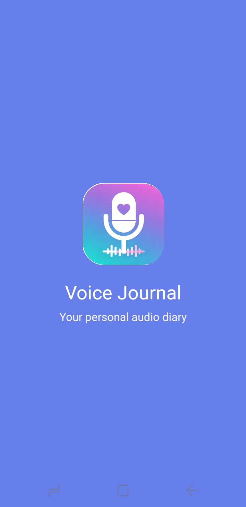
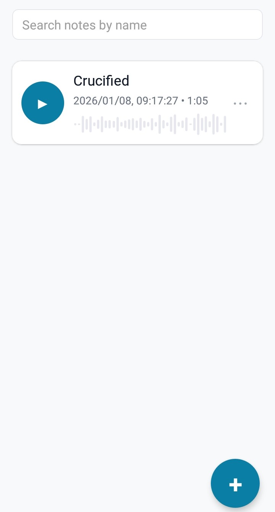
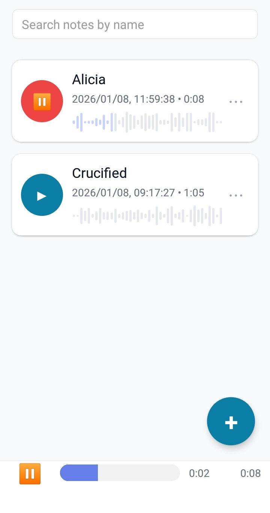

# Audio Recoder - Audio Recorder App

A beautiful and intuitive voice journal application built with React Native and Expo. Record, organize, and playback your audio notes seamlessly on iOS and Android.

## Download

[](https://expo.dev/artifacts/eas/9K3DCqTVQ5sEzWav2BHAvZ.apk)

**Android:** [Download Latest APK](https://expo.dev/artifacts/eas/9K3DCqTVQ5sEzWav2BHAvZ.apk)

---

## App Designs

<!-- Add your app screenshots here -->
<div align="center">
  
  
  
  
</div>

>

---

## Features

- **High-Quality Audio Recording** - Record voice notes with crystal clear audio
- **Audio Playback** - Play, pause, and seek through your recordings
- **Waveform Visualization** - Visual representation of audio with animated waveforms
- **Search Functionality** - Find your notes quickly by name
- **Rename Notes** - Organize your recordings with custom names
- **Persistent Storage** - All notes saved locally with AsyncStorage
- **Backup & Export** - Export/import your notes as JSON with audio files
- **Clean UI/UX** - Modern, intuitive interface with smooth animations
- **Accessibility** - Full accessibility labels and roles
- **Dark Mode Ready** - Supports system theme preferences

---

## Tech Stack

- **Framework:** React Native (Expo)
- **Language:** TypeScript
- **Navigation:** React Navigation (Native Stack)
- **Audio:** expo-av
- **Storage:** AsyncStorage
- **File System:** expo-file-system
- **Animations:** React Native Animated API
- **Build:** EAS Build
- **CI/CD:** GitHub Actions

---

## Installation

### Prerequisites

- Node.js 18+ and npm
- Expo CLI
- EAS CLI (for builds)

### Clone the Repository

```bash
git clone https://github.com/YOUR_USERNAME/AudioRecorder.git
cd AudioRecorder
```

### Install Dependencies

```bash
npm install
```

---

## Running the App

### Development Mode

Start the Expo development server:

```bash
npm start
```

Or run directly on a platform:

```bash
# Android
npm run android

# iOS
npm run ios

# Web
npm run web
```

### Using Expo Go

1. Install [Expo Go](https://expo.dev/client) on your device
2. Run `npm start`
3. Scan the QR code with your device

---

## Building the App

### EAS Build (Recommended)

#### Build APK for Android

```bash
npx eas build --platform android --profile preview
```

#### Build Production APK

```bash
npx eas build --platform android --profile production
```

#### iOS Build

```bash
npx eas build --platform ios --profile preview
```

### Automated Builds with GitHub Actions

This project includes a GitHub Actions workflow that automatically builds the Android APK on every push to `main`.

**Setup:**

1. Generate an Expo access token: https://expo.dev/settings/access-tokens
2. Add it as a GitHub secret named `EXPO_TOKEN`
3. Push to `main` branch - builds run automatically!

---

## 📂 Project Structure

```
AudioRecorder/
├── .github/
│   └── workflows/
│       └── eas-build.yml       # GitHub Actions CI/CD
├── assets/
│   └── images/
│       └── logo_audio_recorder.png
├── src/
│   ├── components/
│   │   ├── playback-bar.tsx
│   │   ├── rename-modal.tsx
│   │   ├── voice-note-card.tsx
│   │   └── waveform.tsx
│   ├── contexts/
│   │   └── VoiceNotesContext.tsx
│   ├── hooks/
│   │   ├── useAudioPlayer.ts
│   │   └── useAudioRecorder.ts
│   ├── navigation/
│   │   └── AppNavigator.tsx
│   ├── screens/
│   │   ├── HomeScreen.tsx
│   │   ├── RecordingScreen.tsx
│   │   ├── SettingsScreen.tsx
│   │   └── SplashScreen.tsx
│   ├── utils/
│   │   ├── backup.ts
│   │   ├── seeded-random.ts
│   │   └── storage.ts
│   └── types.ts
├── App.tsx
├── app.json
├── eas.json
├── package.json
└── tsconfig.json
```

---

## Key Components

### Audio Recording

- **Hook:** `useAudioRecorder` - Manages recording state and permissions
- **Screen:** `RecordingScreen` - UI for recording with timer

### Audio Playback

- **Hook:** `useAudioPlayer` - Handles playback, pause, resume, seek
- **Component:** `PlaybackBar` - Bottom playback controls with progress

### Note Management

- **Context:** `VoiceNotesContext` - Global state for notes (add, remove, rename)
- **Storage:** AsyncStorage persistence

### Waveform Visualization

- **Component:** `Waveform` - Animated audio waveform preview
- **Utility:** `seeded-random` - Deterministic peak generation

---

## Configuration

### EAS Build Profiles

Edit `eas.json` to customize build configurations:

```json
{
  "build": {
    "preview": {
      "android": {
        "buildType": "apk"
      }
    },
    "production": {
      "android": {
        "buildType": "apk"
      }
    }
  }
}
```

### App Configuration

Edit `app.json` for:

- App name and slug
- Icon and splash screen
- Android package name
- Permissions

---

## Author

**Siyabonga Khanyile**

- GitHub: [@siyabongamasiya](https://github.com/siyabongamasiya)

---

## Acknowledgments

- Built with [Expo](https://expo.dev)
- Audio powered by [expo-av](https://docs.expo.dev/versions/latest/sdk/av/)
- Navigation by [React Navigation](https://reactnavigation.org)

---
